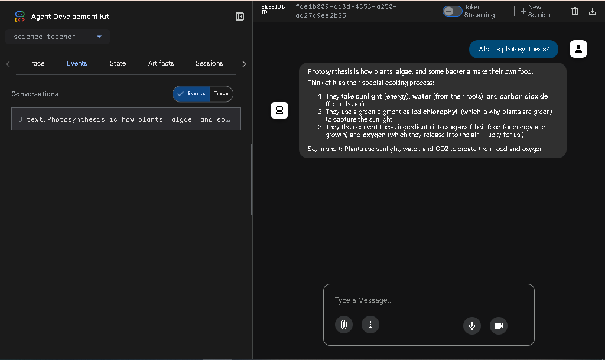
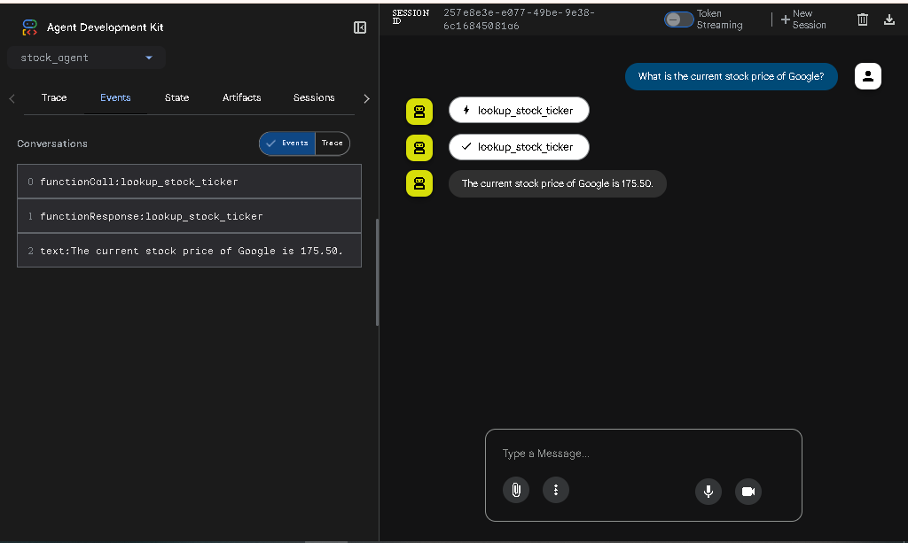
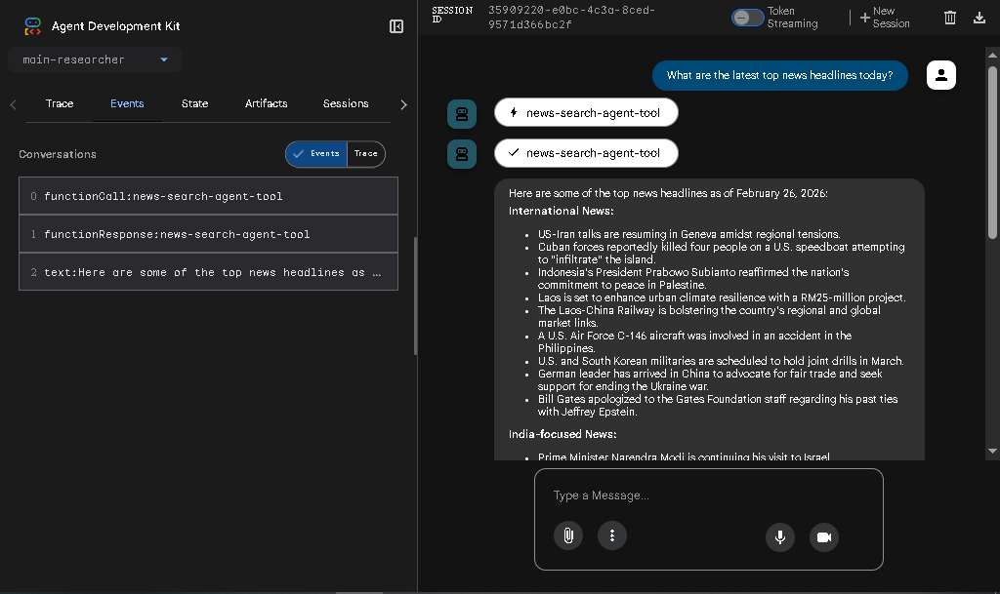
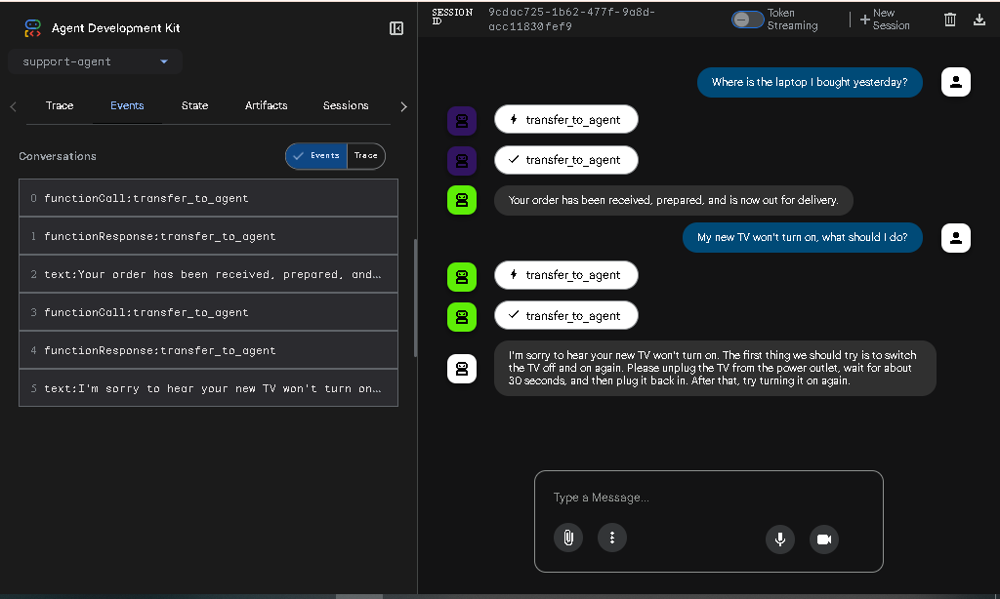
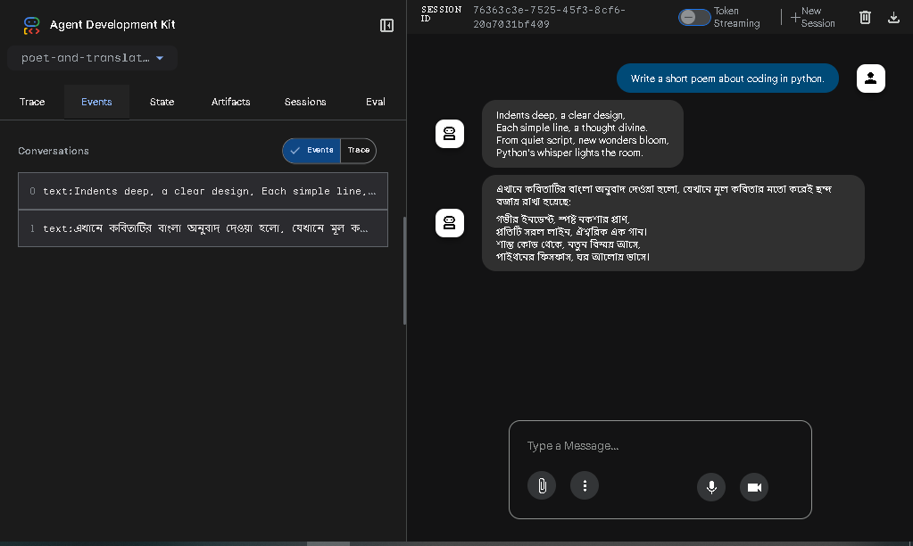
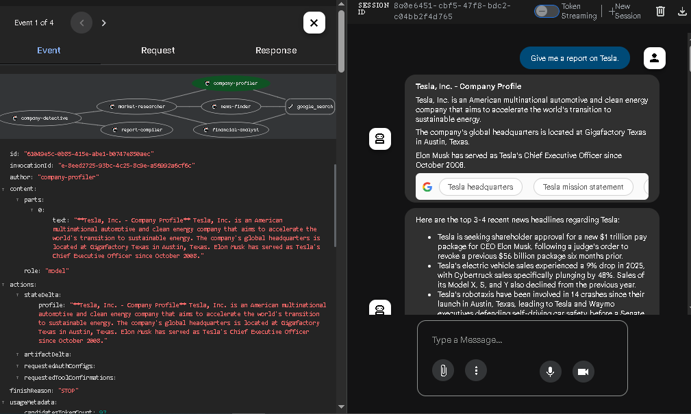
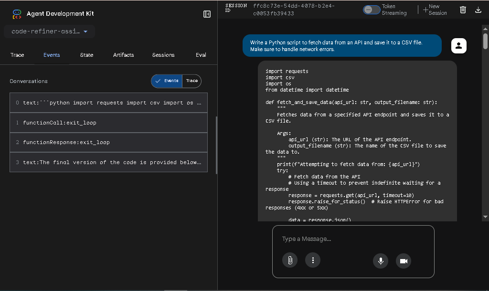

# Agentic AI Workflows in Java

This repository explores modern AI agent architectures using the [Agent Development Kit (ADK)](https://google.github.io/adk-docs/) for Java. It demonstrates how to transition from basic Large Language Model (LLM) prompts to orchestrated, multi-agent systems capable of autonomous reasoning, tool usage, and complex problem-solving.

By treating individual AI agents as specialized microservices, this project showcases advanced execution patterns including sequential pipelines, parallel data fetching, and iterative refinement loops.

## 🧠 Architectures & Agents Built

This project contains several distinct AI agents, each demonstrating a different architectural pattern:

* **`ScienceTeacher` (Persona Agent):** A foundational agent demonstrating system instructions and persona-driven responses.
* **`StockTicker` (Custom Tools):** Demonstrates how to bridge the LLM with external business logic by equipping it with custom Java functions to fetch mock data.
* **`SearchAgentAsTool` (Agents as Tools):** An advanced pattern where a specialized web-searching sub-agent is provided to a main agent as a callable tool using the Google Search integration.
* **`SupportAgent` (Delegation/Routing Workflow):** A supervisor agent that routes user queries to the appropriate specialized sub-agent (Order vs. After-Sales) based on intent.
* **`PoetAndTranslator` (Sequential Assembly Line):** A pipeline architecture where the output of one agent is systematically piped directly into the next.
* **`CompanyDetective` (Parallel Execution):** An orchestrator that deploys three specialized research agents concurrently to gather profile, news, and financial data, significantly reducing I/O latency before synthesizing a final report.
* **`CodeRefiner` (Iterative Loop):** An autonomous "Generate -> Review -> Refine" loop where a Junior Developer agent and Senior Reviewer agent collaborate until a specific quality threshold is met.

## ⚙️ Prerequisites & Setup

To run these agents locally, you will need:
* Java 17+
* Apache Maven
* A Gemini API Key (obtainable from [Google AI Studio](https://aistudio.google.com/apikey))

### 1. Set your API Key

Before running the agents, you must set your API key as an environment variable in your terminal.

**Windows (PowerShell):**
```powershell
$env:GOOGLE_API_KEY="your-api-key-here"

```

**Windows (Command Prompt):**

```cmd
set GOOGLE_API_KEY=your-api-key-here

```

**macOS / Linux:**

```bash
export GOOGLE_API_KEY="your-api-key-here"

```

## 🚀 How to Run

Each agent can be launched via Maven. The ADK Dev UI will start a local server on port 8080.

To run a specific agent, use the following command format, replacing the mainClass with the agent you want to test (e.g., CompanyDetective, CodeRefiner, etc.):

```bash
mvn compile exec:java -Dexec.mainClass=com.example.agent.CompanyDetective

```

Once the terminal indicates the Tomcat server has started, open your browser and navigate to:
http://localhost:8080

---

## 📸 Action Snippets

Here are the agents running in the ADK Dev UI environment:

### 1. Science Teacher (Persona Agent)

### 2. Stock Ticker (Custom API Tool Integration)

### 3. Live Web Search (Agents as Tools)

### 4. Customer Support (Delegation Workflow)

### 5. Poet and Translator (Sequential Pipeline)

### 6. Company Detective (Parallel Execution)

### 7. Code Refiner (Iterative Loop)

---

*Built with Java, Apache Maven, and the Google Agent Development Kit.*

```